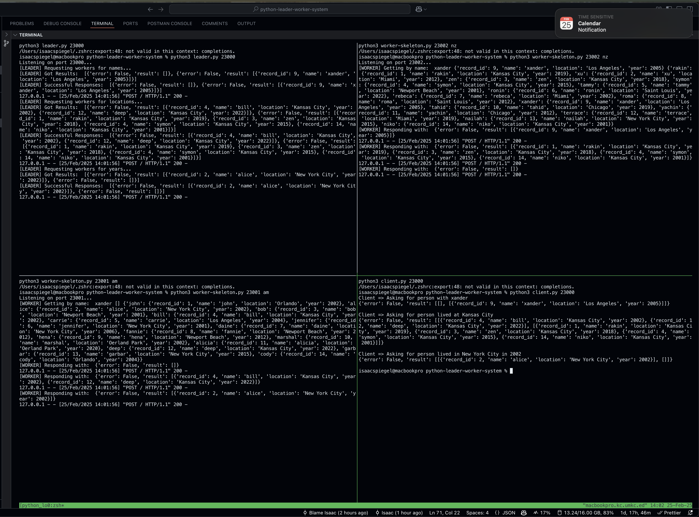

# Simple Distributed Master-Worker Paradigm

To run:
- Install python3
- Run the scripts providing necessary parameters

OR

./run-w-tmux

## Decisions

We don't return error when any single worker node is down, rather we only return the results we get from the available worker nodes.

Results are wrapped in list for each node that responds, so the client can easily infer how many nodes responded without having to parse some error.

## In Action



## Prompt

In this assignment, we will program and build a distributed master-worker paradigm for distributed execution of tasks and answering queries. In that setup, we have one or more client programs (hereafter "client") communicate with a "master" process and pass their queries to the master. The query here refers to a client asking about an individual person by their name and other attributes. In that, the system stores information about an individual's name, residence location, and year of residence in a "data table" (similar to the one shown in class). A sample data record looks like the following indexed by name in a dictionary:

```json
"carrie": {
    "record_id": 5,
    "name": "carrie",
    "location": "Los Angeles",
    "year": 2004
}
```

The query can be either by name or by location or year, in which the master responds with all data items that satisfy the query.

In finer details, the master receives a query from the client but does not actually respond to the query itself, instead, it passes the query to one of the two workers (call them worker 1 and worker 2). To balance the load across the workers, the master splits the workload equally: if the query contains a name that starts with a letter from a to m (all names are in lowercase), it is forwarded to worker 1; otherwise, it is forwarded to worker 2. That means worker 1 handles a-m and worker 2 handles n-z. When the results are returned from the respective worker, the master combines them and returns them as a list to the client.

The schematic diagram looks like this with the associated port the processes are listening on:

master-worker-1.png

We will use RPC as the mode of communication across client, master, and worker and the data format across processes will be JSON (in case you use Python, you can assume regular python objects/dictionaries are being communicated).

Master and Worker will implement the following RPC calls (at least).

- `getbyname(name)`: returns person information matching the "name"
- `getbylocation(location)`: returns person information who lived in the specific location
- `getbyyear(location, year)`: returns person information who lived in a specific location at a specific year

Note that for handling queries with location and year, the query needs to go to both the workers.

Two separate JSON data files (`data-am.json` and `data-nz.json`) are given that will be loaded by the respective worker to store in their data table. The master process will not contain any data.

The client program is rather simple. It makes a set of RPC calls to the master asking for individual persons by name, by name, and by year. A sample client program (client.py) is given to test your code.

### Tasks

- Implement master and worker program (a skeleton code in Python is given to fill in)
- Document your program (put comments in the source code as you implement)
- Run them and test your code.
- Since there are four programs to run, you will need four terminals/consoles to run them 
  - `python3 master.py 23000`
  - `python3 worker.py 23001 am`
  - `python3 worker.py 23002 nz`
  - `python3 client.py 23000`
- Handle error cases as necessary
- Handle failure cases (e.g., kill one of your worker processes, the service should still be ON)

### Submission

Put your source code and a short document file describing any interesting observation you noticed when you program this into a zip file and upload.
If you want to build a repository (on Github, google code), you can do so and send a link. You must keep the repo private so that you can claim you worked alone and none copied from you.
Put a README file to describe how to run your code if you implement it using another programming language other than Python.
You record a video demonstrating how your programs run and submit it under the folder "Programming Assignment-1" under "Panopto Video".
